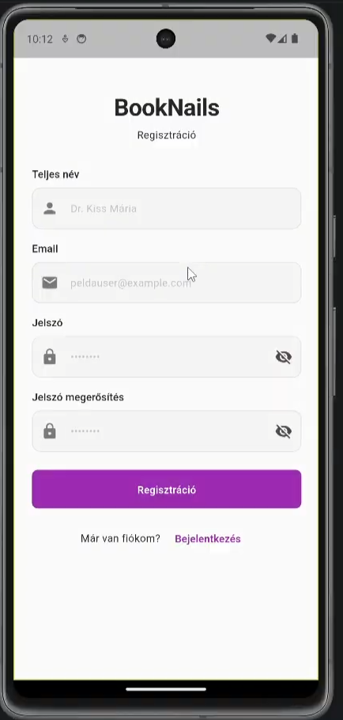
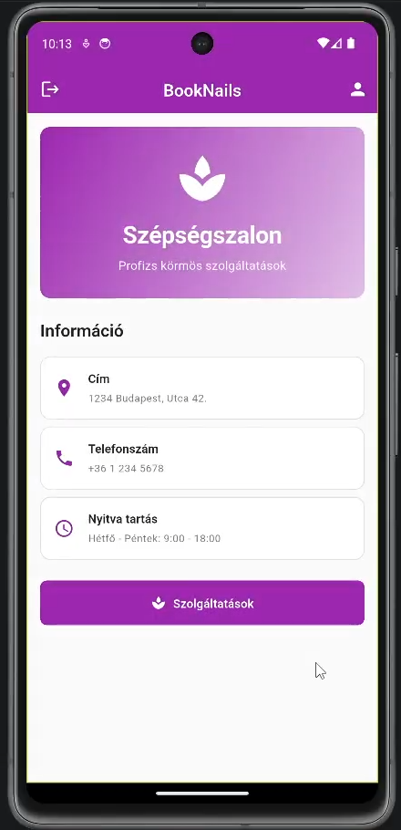
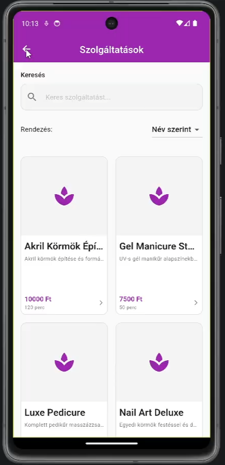
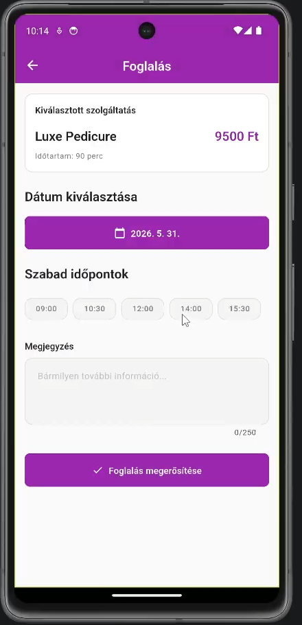
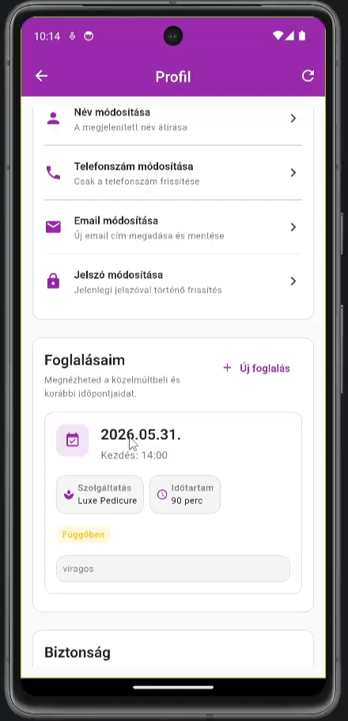
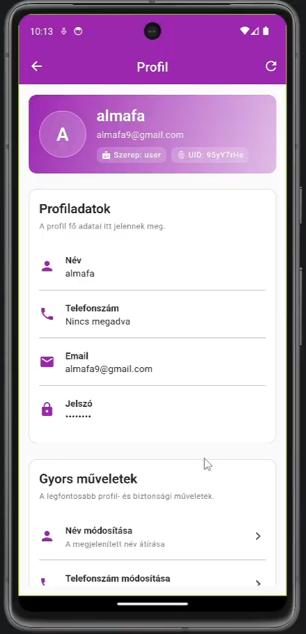
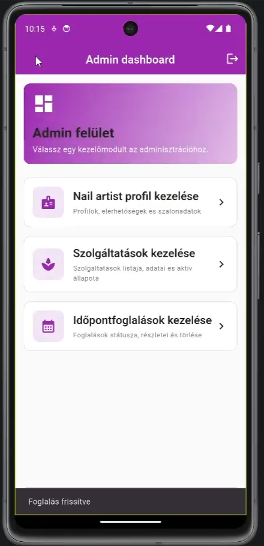
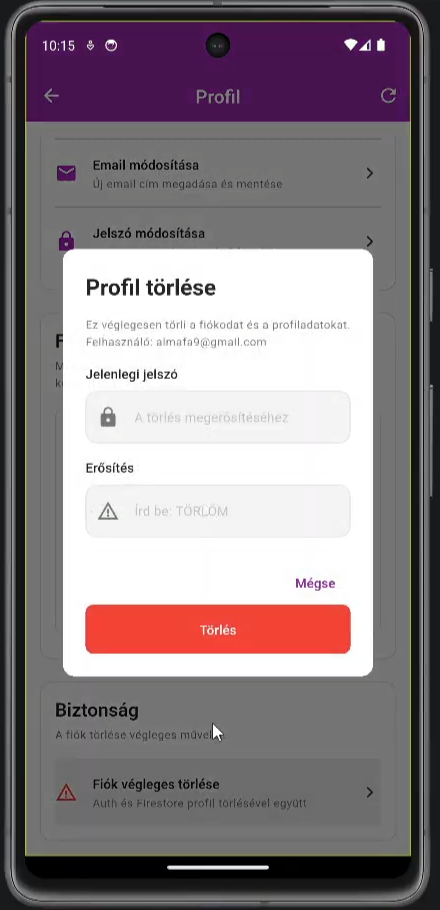

# BookNails

<p align="center">
  
  
  
</p>

A Flutter mobile app concept for booking nail salon services, managing appointments, and exploring a role-based salon workflow.

> Note: The current application UI is primarily in Hungarian.
>
> Important: This application uses an active Firebase backend for authentication, Firestore data, and file storage. The Firebase project configuration is included for the Android build.

---

## Overview

BookNails is a mobile-first application designed for a modern nail salon booking experience. It supports customer, nail artist, and administrator workflows, allowing users to browse services, review salon profiles, choose available time slots, and manage appointment requests through a clean, intuitive interface.

Firebase provides the application backend. Firebase Authentication manages accounts and sessions, Cloud Firestore stores users, services, categories, artist profiles, and appointments, and Firebase Storage is available for uploaded media such as gallery images.

## Why this project

This project demonstrates a realistic booking-app architecture for a service business with:

- a clear multi-role flow
- a polished mobile-first UI
- modular app structure
- appointment workflow logic
- reusable components and app theming

## Key Features

- user registration and login flow
- salon/home screen presentation
- service browsing and filtering
- appointment booking workflow
- appointment status tracking
- nail artist dashboard for service and booking management
- profile editing and personalization
- role-based navigation and UI behavior

## Tech Stack

- Flutter
- Dart
- Cubit / BLoC state management
- Material Design UI
- App-level theming and shared widgets
- Firebase Core
- Firebase Authentication
- Cloud Firestore
- Firebase Storage
- GoRouter for navigation

## Project Structure

```text
.
├── docs/
│   ├── SPECIFICATION.md
│   ├── DATAMODEL.md
│   ├── COMPONENTS.md
│   └── AI_PROMPT_LOG.md
├── lib/
│   ├── bloc/
│   ├── models/
│   ├── screens/
│   ├── services/
│   ├── shared/
│   ├── theme/
│   ├── firebase_options.dart
│   └── main.dart
├── test/
├── integration_test/
├── android/
├── analysis_options.yaml
├── pubspec.yaml
├── firebase.json
├── firestore.rules
├── README.md
└── .gitignore
```

## Documentation

The project documentation is stored in the docs folder and includes the original functional and architectural planning material.

- [docs/SPECIFICATION.md](docs/SPECIFICATION.md) — functional and non-functional requirements
- [docs/DATAMODEL.md](docs/DATAMODEL.md) — application entities, relationships, and collection structure
- [docs/COMPONENTS.md](docs/COMPONENTS.md) — component tree and screen architecture
- [docs/AI_PROMPT_LOG.md](docs/AI_PROMPT_LOG.md) — AI-assisted planning and review notes

## Getting Started

### Prerequisites

- Flutter SDK
- Dart SDK
- Android Studio / Android SDK
- a physical device or emulator
- access to the Firebase project configured for the app (`booknail`)

### Install and run

```bash
git clone https://github.com/your-username/BookNails.git
cd BookNails

flutter pub get
flutter run
```

The current Firebase configuration is stored in [`lib/firebase_options.dart`](lib/firebase_options.dart) and currently provides Android platform settings. The app initializes Firebase before starting the Flutter application, so a device or emulator with network access is required for authentication and cloud data.

## Firebase Status

Firebase is active and is part of the application runtime.

- **Firebase Authentication** handles email/password registration, login, logout, and auth-state changes.
- **Cloud Firestore** stores users, categories, services, nail artist profiles, and appointments.
- **Firebase Storage** is included for cloud-hosted media and gallery assets.
- **Firestore security rules** are maintained in [`firestore.rules`](firestore.rules).
- **Firebase initialization** is handled in `lib/main.dart` using the generated platform options.

The repository also includes [`seed_firestore.js`](seed_firestore.js) for populating Firestore with demo data. It requires a Firebase Admin SDK service-account key named `firebase-key.json` in the project root. Keep that file local and never commit it.

To seed the database:

```bash
npm install
npm run seed
```

The seed script writes demo data directly to the configured Firebase project, so review the target project and service-account permissions before running it.

## Screenshots

<p align="center">
  <a href="docs/screenshots/signup.png" target="_blank" rel="noopener noreferrer">
    
  </a>
  <a href="docs/screenshots/home.png" target="_blank" rel="noopener noreferrer">
    
  </a>
  <a href="docs/screenshots/servicelist.png" target="_blank" rel="noopener noreferrer">
    
  </a>
  <a href="docs/screenshots/makinappointment.png" target="_blank" rel="noopener noreferrer">
    
  </a>
</p>
<p align="center">
  <a href="docs/screenshots/appointment.png" target="_blank" rel="noopener noreferrer">
    
  </a>
  <a href="docs/screenshots/profile.png" target="_blank" rel="noopener noreferrer">
    
  </a>
  <a href="docs/screenshots/adminhome.png" target="_blank" rel="noopener noreferrer">
    
  </a>
  <a href="docs/screenshots/delete.png" target="_blank" rel="noopener noreferrer">
    
  </a>
</p>

## Notes

This project is suitable for showcasing:

- Flutter app architecture
- UI and interaction design in a booking workflow
- role-based application flows
- scalable modular project organization

## License

This project is intended for educational and portfolio use unless otherwise specified by the repository owner.

